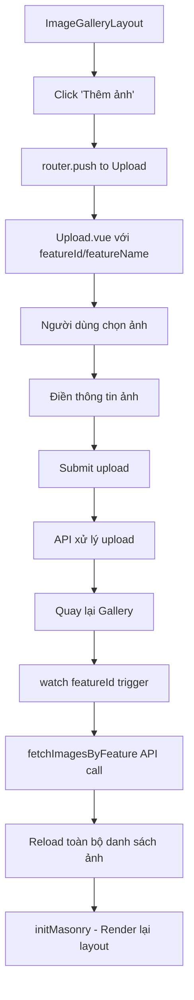

# Quy Trình Tải Ảnh Lên Của Người Dùng

## Tổng Quan

Hệ thống cho phép người dùng tải ảnh lên theo từng tính năng (feature) cụ thể. Quá trình này bao gồm việc điều hướng từ gallery đến trang upload và quay lại với dữ liệu được cập nhật.

## Luồng Chính (Main Flow)

### 1. Khởi Điểm - ImageGalleryLayout.vue

```vue
<!-- Nút thêm ảnh trong gallery -->
<div 
  class="masonry-item w-[300px] h-[300px] border-2 border-dashed border-gray-300 rounded-lg flex items-center justify-center cursor-pointer hover:bg-gray-50 transition"
  @click="openFileSelector"
>
  <div class="text-center">
    <svg>...</svg>
    <p class="mt-2 text-sm text-gray-500">Thêm ảnh</p>
  </div>
</div>
```

**Hành động:** Người dùng click vào nút "Thêm ảnh"

**Code xử lý:**
```javascript
const openFileSelector = () => {
  router.push({ 
    name: 'upload', 
    query: { 
      featureId: featureId.value, 
      featureName: featureName.value 
    } 
  })
}
```

### 2. Chuyển Hướng - Upload.vue

**Route Parameters:**
- `featureId`: ID của tính năng
- `featureName`: Tên của tính năng

**Khởi tạo trang upload:**
```javascript
setup() {
  const imageUploadInstance = useImageUpload();
  const route = useRoute();
  const featureId = computed(() => route.query.featureId);
  const featureName = computed(() => route.query.featureName);
  
  // Cung cấp instance cho các component con
  provide('imageUploadInstance', imageUploadInstance);
}
```

### 3. Tính Năng Upload

**Giới hạn:**
- Tối đa 5 ảnh
- Mỗi ảnh tối đa 2MB
- Định dạng hỗ trợ: JPG, PNG

**Components liên quan:**
- `ImageUploader`: Xử lý việc chọn và preview ảnh
- `ImageInfoForm`: Thu thập thông tin mô tả ảnh

**State Management:**
```javascript
const { files, uploadErrors, totalFiles, remainingSlots } = imageUploadInstance;

const uploadStatus = computed(() => {
  if (totalFiles.value === 0) return "Chưa có ảnh nào được tải lên";
  return `Đã tải lên ${totalFiles.value}/5 ảnh, còn lại ${remainingSlots.value} ảnh`;
});
```

### 4. Xử Lý Sau Upload

Sau khi người dùng upload thành công và quay lại gallery, hệ thống sẽ **reload toàn bộ dữ liệu từ API**.

## Hành Vi Reload Dữ Liệu

### Cơ Chế Watch trong ImageGalleryLayout.vue

```javascript
// Theo dõi featureId để tải lại dữ liệu khi thay đổi
watch(featureId, async (newId, oldId) => {
  console.log(`featureId thay đổi từ ${oldId} thành ${newId}`);
  if (newId && newId !== oldId) {
    await fetchImagesByFeature(newId);
  }
  nextTick(() => {
    initMasonry()
  })
}, { immediate: true });
```

### Kết Quả

🔄 **RELOAD TOÀN BỘ**: Khi người dùng quay lại từ trang upload, hệ thống sẽ:

1. **Gọi lại API** `fetchImagesByFeature(featureId)` để lấy tất cả ảnh của feature
2. **Thay thế hoàn toàn** danh sách ảnh hiện tại
3. **Khởi tạo lại** masonry layout cho hiển thị
4. **Ảnh mới sẽ xuất hiện ở vị trí** do API trả về (thường là đầu danh sách nếu sắp xếp theo thời gian mới nhất)

### So Sánh với Phương Pháp Thêm Vào Đầu

| Phương Pháp | Hiện Tại | Thêm Vào Đầu |
|-------------|----------|---------------|
| **Performance** | Tốt cho dữ liệu nhỏ | Tốt hơn cho dữ liệu lớn |
| **Đảm bảo đồng bộ** | ✅ Luôn đồng bộ với server | ❌ Có thể miss data từ người khác |
| **Network calls** | ❌ Gọi lại toàn bộ API | ✅ Chỉ cần gọi API cho ảnh mới |
| **Complexity** | ✅ Đơn giản | ❌ Phức tạp hơn (merge data) |

## Luồng Chi Tiết



## Ưu Nhược Điểm

### ✅ Ưu Điểm
- **Dữ liệu luôn đồng bộ** với server
- **Đơn giản** trong việc implementation
- **Đảm bảo tính nhất quán** của dữ liệu
- **Phù hợp** với pagination hiện tại

### ❌ Nhược Điểm
- **Performance** không tối ưu với dữ liệu lớn
- **Bandwidth** sử dụng nhiều hơn cần thiết
- **User experience** có thể bị gián đoạn (loading state)
- **Mất vị trí scroll** hiện tại của người dùng

## Khuyến Nghị Cải Tiến

Để tối ưu hóa trải nghiệm người dùng, có thể cân nhắc:

1. **Optimistic Updates**: Thêm ảnh vào đầu danh sách ngay lập tức
2. **Incremental Loading**: Chỉ fetch ảnh mới từ API
3. **Cache Strategy**: Sử dụng cache để giảm API calls
4. **Scroll Position Memory**: Lưu và khôi phục vị trí scroll

## Kết Luận

Hiện tại hệ thống sử dụng phương pháp **reload toàn bộ** khi có ảnh mới được upload. Điều này đảm bảo tính đồng bộ cao nhưng có thể ảnh hưởng đến performance và UX khi dữ liệu lớn. 