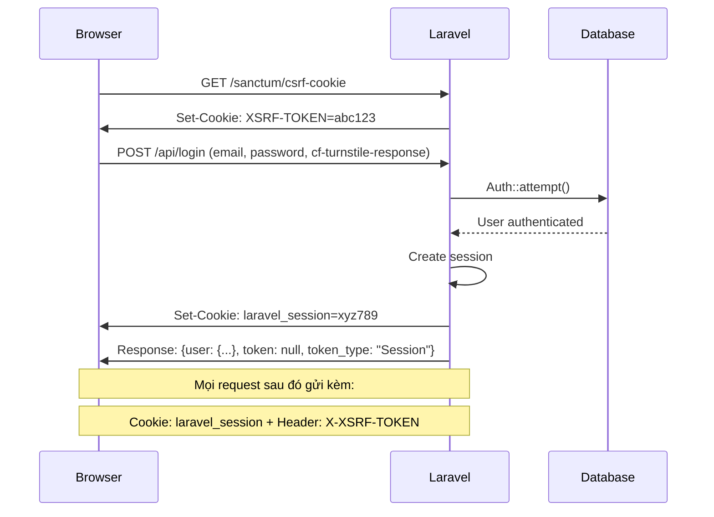
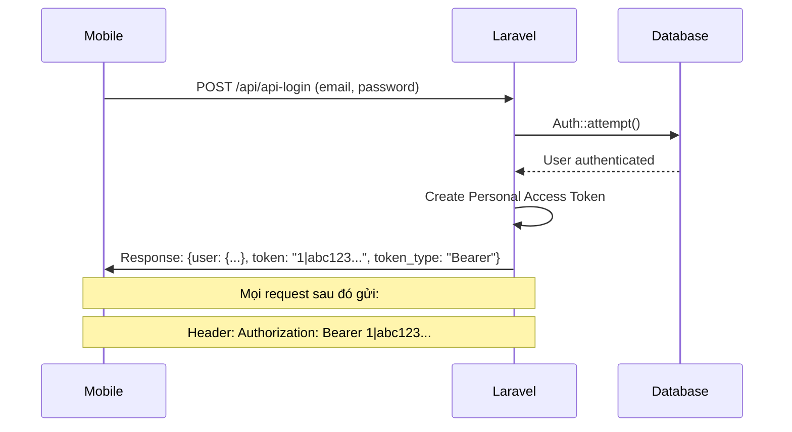

# 🔐 **Hướng dẫn cấu hình Sanctum Session + Bearer Token Authentication**

## 📋 **Tổng quan kiến trúc**

Dự án này sử dụng **Laravel Sanctum** với **2 phương thức authentication**:

1. **🌐 Web (SPA)**: Session-based authentication + CSRF protection
2. **📱 Mobile/API Client**: Bearer token authentication

## ⚙️ **Cấu hình môi trường (.env)**

### **Session Configuration (QUAN TRỌNG cho Web Auth)**
```env
# === SESSION CONFIGURATION ===
SESSION_DRIVER=file                    # file, database, redis
SESSION_LIFETIME=120                   # 2 giờ
SESSION_DOMAIN=.localhost              # Domain cho session cookie
SESSION_SECURE_COOKIE=false            # true trên HTTPS
SESSION_HTTP_ONLY=true                 # Bảo mật cookie
SESSION_SAME_SITE=lax                  # lax, strict, none
```

### **Sanctum Configuration**
```env
# === SANCTUM CONFIGURATION ===
# Các domain được coi là "stateful" (web SPA)
SANCTUM_STATEFUL_DOMAINS=localhost,127.0.0.1,localhost:3000,localhost:5173,127.0.0.1:5173

# Prefix cho token (tùy chọn)
SANCTUM_TOKEN_PREFIX=
```

### **CORS Configuration**
```env
# === CORS CONFIGURATION ===
# BẬT credentials để hỗ trợ session cookies
CORS_SUPPORTS_CREDENTIALS=true
```

## 🔄 **Luồng hoạt động**

### **1. Web Authentication (Session + CSRF)**



**Chi tiết:**
- **Bước 1**: Browser gọi `GET /sanctum/csrf-cookie` để lấy CSRF token
- **Bước 2**: Browser gọi `POST /api/login` với credentials + CSRF token
- **Bước 3**: Laravel `Auth::attempt()` xác thực và **tự động tạo session**
- **Bước 4**: Session được lưu vào:
  - **File**: `storage/framework/sessions/` (mặc định)
  - **Database**: bảng `sessions` (nếu `SESSION_DRIVER=database`)
  - **Redis**: nếu `SESSION_DRIVER=redis`
- **Bước 5**: Browser nhận 2 cookies:
  - `laravel_session`: chứa session ID
  - `XSRF-TOKEN`: chứa CSRF token

### **2. Mobile Authentication (Bearer Token)**



## 🛠️ **Cấu hình Database (nếu dùng SESSION_DRIVER=database)**

### **1. Tạo migration cho sessions table**
```bash
php artisan session:table
php artisan migrate
```

### **2. Cập nhật .env**
```env
SESSION_DRIVER=database
SESSION_TABLE=sessions
```

## 🔒 **Bảo mật và Production**

### **HTTPS Production**
```env
SESSION_SECURE_COOKIE=true
SESSION_SAME_SITE=strict
SESSION_DOMAIN=.yourdomain.com
```

### **Domain Configuration**
```env
# Production
SANCTUM_STATEFUL_DOMAINS=yourdomain.com,www.yourdomain.com,app.yourdomain.com

# Development
SANCTUM_STATEFUL_DOMAINS=localhost,127.0.0.1,localhost:3000,localhost:5173
```

## 📱 **Frontend Implementation**

### **Web (Vue.js SPA)**
```javascript
// 1. Lấy CSRF token trước khi login
await refreshCsrfToken()

// 2. Login (sẽ nhận session cookie)
const response = await authAPI.login(credentials)
// response.data.token = null (web không cần token)

// 3. Mọi request sau đó tự động gửi cookies
// Interceptor tự động thêm X-XSRF-TOKEN header
```

### **Mobile/API Client**
```javascript
// 1. Login để nhận Bearer token
const response = await authAPI.mobileLogin(credentials)
const token = response.data.token

// 2. Lưu token
localStorage.setItem('token', token)
localStorage.setItem('MOBILE_CLIENT', '1')

// 3. Mọi request tự động gửi Authorization header
```

## 🧪 **Testing**

### **Test Web Session**
```bash
# 1. Gọi CSRF endpoint
curl -c cookies.txt -b cookies.txt http://localhost:8000/sanctum/csrf-cookie

# 2. Login
curl -c cookies.txt -b cookies.txt -X POST http://localhost:8000/api/login \
  -H "Content-Type: application/json" \
  -H "X-XSRF-TOKEN: [token_from_step_1]" \
  -d '{"email":"test@example.com","password":"password","cf-turnstile-response":"test"}'

# 3. Gọi protected endpoint
curl -c cookies.txt -b cookies.txt http://localhost:8000/api/user/1
```

### **Test Mobile Token**
```bash
# 1. Login để nhận token
curl -X POST http://localhost:8000/api/api-login \
  -H "Content-Type: application/json" \
  -d '{"email":"test@example.com","password":"password"}'

# 2. Gọi protected endpoint với Bearer token
curl -H "Authorization: Bearer [token_from_step_1]" \
  http://localhost:8000/api/user/1
```

## ❓ **FAQ**

### **Q: Session được lưu ở đâu?**
**A**: Tùy `SESSION_DRIVER`:
- `file`: `storage/framework/sessions/`
- `database`: bảng `sessions`
- `redis`: Redis server

### **Q: Tại sao web không cần token?**
**A**: Web dùng **session cookie** (`laravel_session`) + **CSRF token**. Laravel tự động đọc session từ cookie khi gọi `Auth::check()`.

### **Q: Mobile có thể dùng session không?**
**A**: Có thể, nhưng không khuyến khích vì:
- Mobile app không lưu cookies tốt
- Session timeout có thể gây UX kém
- Bearer token dễ quản lý hơn cho mobile

### **Q: Làm sao biết request từ web hay mobile?**
**A**: 
- **Web**: Có `laravel_session` cookie + `X-XSRF-TOKEN` header
- **Mobile**: Có `Authorization: Bearer` header
- **Sanctum**: Tự động detect và xử lý phù hợp

## 🔧 **Troubleshooting**

### **Session không được tạo**
1. Kiểm tra `SESSION_DRIVER` trong `.env`
2. Đảm bảo `storage/framework/sessions/` có quyền write
3. Kiểm tra `SANCTUM_STATEFUL_DOMAINS` có đúng domain không

### **CSRF token mismatch**
1. Gọi `/sanctum/csrf-cookie` trước khi login
2. Đảm bảo `X-XSRF-TOKEN` header được gửi đúng
3. Kiểm tra `CORS_SUPPORTS_CREDENTIALS=true`

### **Cookie không được gửi**
1. Kiểm tra domain trong `SESSION_DOMAIN`
2. Đảm bảo `withCredentials: true` trong Axios
3. Kiểm tra CORS configuration
